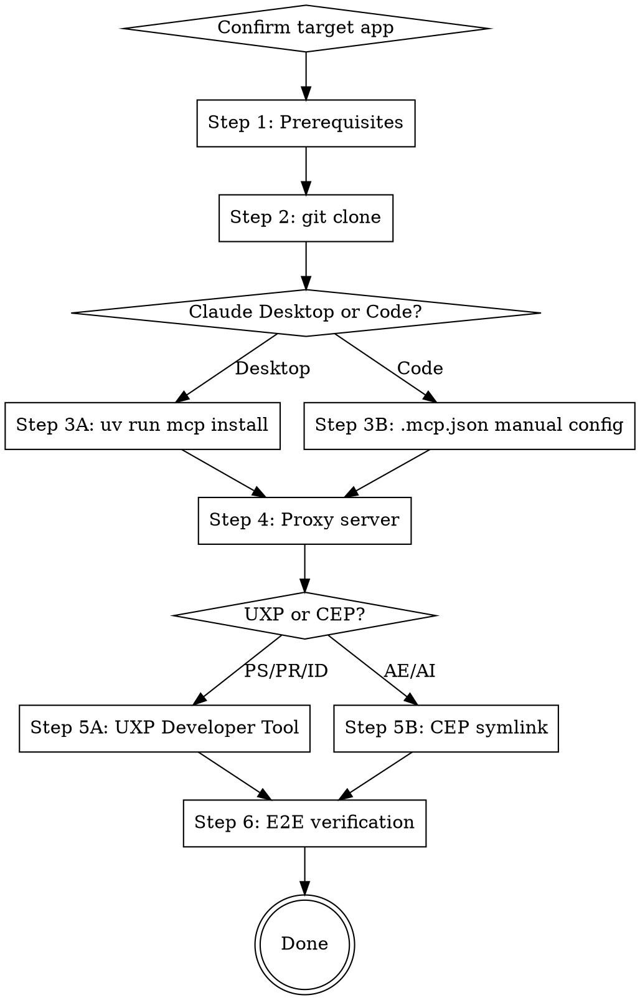

# Adobe MCP (adb-mcp) Setup

Adobe creative apps controlled via MCP. All communication stays on localhost — no external servers.

## Architecture

```
Claude ←stdio→ MCP Server (Python) ←ws://localhost:3001→ Proxy (Node.js) ←→ Plugin (UXP/CEP) ←→ Adobe App
```

## Quick Reference

| App | Plugin | MCP Script | Manifest | Extra Dep | Min Version |
|-----|--------|-----------|----------|-----------|-------------|
| Photoshop | UXP | `ps-mcp.py` | `uxp/ps/manifest.json` | `numpy` | 26.0+ |
| Premiere | UXP | `pr-mcp.py` | `uxp/pr/manifest.json` | `pillow` | Beta 25.3.46+ |
| InDesign | UXP | `id-mcp.py` | `uxp/id/manifest.json` | `pillow` | latest |
| After Effects | CEP | `ae-mcp.py` | (symlink) | `pillow` | latest |
| Illustrator | CEP | `ai-mcp.py` | (symlink) | `pillow` | latest |

Common deps: `fonttools python-socketio mcp requests websocket-client`

## Setup Flow



---

## Step 1: Prerequisites

Run these 4 checks in **parallel**:

```bash
python3 --version   # 3.10+ required
node --version      # any recent
uv --version        # any
git --version       # any
```

**GATE**: All 4 output versions → PASS. Missing → install first:

| Missing | macOS | Windows |
|---------|-------|---------|
| Python | `brew install python` | python.org |
| Node | `brew install node` | nodejs.org |
| uv | `brew install uv` or `pip install uv` | `pip install uv` |
| git | `brew install git` | git-scm.com |

Also required (manual install):
- **Adobe UXP Developer Tool**: Install from Creative Cloud
- **Target Adobe app**: Min Version from Quick Reference

---

## Step 2: Clone

```bash
git clone https://github.com/mikechambers/adb-mcp.git
cd adb-mcp
```

**GATE**: `ls mcp/ps-mcp.py` succeeds → PASS.

---

## Step 3: MCP Server Registration

### 3A: Claude Desktop (auto-register)

Run from `mcp/` directory. Look up `{SCRIPT}` and `{EXTRA_DEP}` in Quick Reference:

```bash
cd mcp
uv run mcp install \
  --with fonttools --with python-socketio --with mcp \
  --with requests --with websocket-client --with {EXTRA_DEP} \
  {SCRIPT}
```

Example: Photoshop → `--with numpy ps-mcp.py`, Premiere → `--with pillow pr-mcp.py`

Restart Claude Desktop after install.

### 3B: Claude Code (manual .mcp.json)

See [references/mcp-configs.md](references/mcp-configs.md) for per-app JSON config.

Key rules:
1. Use `uv` **absolute path** for `command` (`which uv`)
2. Use MCP script **absolute path** as last arg
3. Save to project `.mcp.json` or global `~/.claude.json`

**GATE**: MCP tools visible in Claude → PASS. On error see Troubleshooting.

---

## Step 4: Proxy Server

Relays MCP Server ↔ Plugin. **Must stay running during work.**

**From source (recommended):**
```bash
cd adb-proxy-socket && npm install && node proxy.js
```

**Prebuilt binary:**
GitHub Releases → download for platform → run.
- macOS Intel: `adb-proxy-socket-macos-x64.zip`
- macOS Apple Silicon: `adb-proxy-socket-macos-arm64.zip`
- Windows: `adb-proxy-socket-win-x64.exe.zip`

**GATE**: Terminal shows:
```
adb-mcp Command proxy server running on ws://localhost:3001
```

---

## Step 5: Plugin Install

### 5A: UXP (Photoshop, Premiere, InDesign)

1. Launch Adobe app
2. (Photoshop only) Settings > Plugins > **Enable Developer Mode** > restart
3. Launch **UXP Developer Tool** from Creative Cloud
4. File > Add Plugin > select Manifest path from Quick Reference
5. Click **Load**
6. In Adobe app plugin panel, click **Connect**

**GATE**: Proxy terminal shows:
```
Client ... registered for application: {appname}
```

IMPORTANT: Must re-Load via UXP Developer Tool after every app restart.

### 5B: CEP (After Effects, Illustrator)

See [references/mcp-configs.md](references/mcp-configs.md) for symlink commands.

**GATE**: Plugin panel visible in Adobe app + Proxy terminal connection log → PASS.

---

## Step 6: End-to-End Verification

All 3 must pass:

| # | Check | How |
|:-:|-------|-----|
| 1 | Proxy running | Terminal: `running on ws://localhost:3001` |
| 2 | Plugin connected | Proxy terminal: `registered for application` |
| 3 | MCP tools work | Test prompt succeeds |

**Test prompts** (pick by app):
- PS: "Get info about the current Photoshop document"
- PR: "Show current Premiere project info"
- AE/AI: "Run execute_extend_script to print app version"

**GATE**: Tool call succeeds + app info returned → PASS. Setup complete.

---

## Daily Session Startup

After initial setup, start each session:

```
1. Run Proxy (node proxy.js or binary)
2. Launch Adobe app
3. (UXP only) UXP Developer Tool > Load > Connect in app
4. Start Claude
```

---

## Troubleshooting

| Symptom | Cause | Fix |
|---------|-------|-----|
| MCP server error in Claude | `uv` relative path | `which uv` → use absolute path in config |
| Connect button no response | Proxy not running or port conflict | `lsof -i :3001`, restart Proxy |
| Plugin Load fails | Developer Mode not enabled | PS: Settings > Plugins > Enable Developer Mode |
| Slow responses | Context accumulation | Start new conversation |
| Some fonts missing | Default 1000 limit | Specify PostScript name directly |
| AI confused after manual edit | State mismatch | Tell AI: "I just added a layer manually" |

More issues: https://github.com/mikechambers/adb-mcp/issues

---

## Security

| Risk | Level | Mitigation |
|------|:-----:|------------|
| Proxy unauthenticated (localhost:3001) | Medium | Stop Proxy after work. Don't run 24/7 |
| ExtendScript arbitrary execution (AE/AI) | High | Review code before execution. Prompt injection risk |
| Prebuilt binary trust | Low | Prefer source build (`npm install && node proxy.js`) |

---

## Common Mistakes

| Mistake | Correct Approach |
|---------|-----------------|
| Relative path for `uv` in config | `which uv` → absolute path |
| Connect without Proxy | Start Proxy first → then Connect |
| Use app right after restart | Re-Load plugin via UXP Developer Tool |
| Manual edits during AI work | Wait for AI, or notify about changes |
| Using `pillow` for Photoshop config | PS uses `numpy`, all others use `pillow` |
