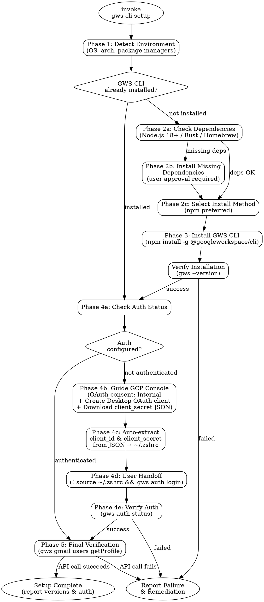

# GWS CLI Setup

<HARD-GATE>
Do NOT declare setup complete until ALL phases pass verification.
Phases: detect environment → install dependencies & CLI → configure auth → verify working state
Skipping verification or declaring success without evidence violates this gate.
</HARD-GATE>

<CONTEXT>
- 사용자는 회사 Google Workspace 계정을 사용한다 (개인 계정이 아님).
- npm 패키지명: `@googleworkspace/cli` (다른 이름으로 시도하지 말 것).
- gws CLI 명령어 문법: 서브커맨드는 점(.)이 아닌 공백으로 구분하고, 파라미터는 `--params '{JSON}'` 형태로 전달한다.
</CONTEXT>

## Checklist

Complete every step in order. Do not skip, reorder, or abbreviate.

1. **Detect environment** — Identify OS, architecture, and available package managers. Record results before proceeding.
2. **Check if GWS CLI is already installed** — Run `gws --version`. If installed, skip to step 6.
3. **Check and install dependencies** — Verify Node.js 18+ (for npm method), Rust/Cargo (for cargo method), or Homebrew (for brew method). Install missing dependencies with user approval. *(pause for user approval before installing)*
4. **Install GWS CLI** — `npm install -g @googleworkspace/cli`. This is the canonical package name. Do NOT try other package names.
5. **Verify installation** — Run `gws --version` and confirm it returns a valid version string. If it fails, report the error and stop.
6. **Check auth status** — Run `gws auth status` to determine if authentication is configured.
7. **Guide auth setup** — If not authenticated, guide through Google Cloud Console OAuth setup (see Phase 4) then hand off `! gws auth login` to the user.
8. **Final verification** — Run `gws gmail users getProfile --params '{"userId": "me"}'` to confirm end-to-end functionality. Report installed version and auth status.

## Phase Details

### Phase 1: Environment Detection

```bash
# Detect OS and architecture
uname -s    # Darwin, Linux, MINGW64_NT-*
uname -m    # x86_64, arm64, aarch64

# Detect available package managers
command -v npm    && npm --version
command -v brew   && brew --version
command -v cargo  && cargo --version
command -v nix    && nix --version
```

Record: `OS`, `ARCH`, `AVAILABLE_MANAGERS[]`

### Phase 2: Dependency Check & Installation

| Install Method | Required Dependency | Check Command | Install Command |
|---------------|-------------------|---------------|-----------------|
| npm | Node.js 18+ | `node --version` | Platform-dependent (see below) |
| brew | Homebrew | `brew --version` | `/bin/bash -c "$(curl -fsSL https://raw.githubusercontent.com/Homebrew/install/HEAD/install.sh)"` |
| cargo | Rust toolchain | `cargo --version` | `curl --proto '=https' --tlsv1.2 -sSf https://sh.rustup.rs \| sh` |

**Node.js installation by platform:**
- macOS (brew available): `brew install node`
- macOS (no brew): Download from nodejs.org or use nvm
- Linux (apt): `sudo apt-get install -y nodejs npm`
- Linux (yum/dnf): `sudo dnf install -y nodejs npm`

**Install method selection logic:**
```
if npm available AND node >= 18:
    method = "npm"
elif brew available:
    method = "brew"  # brew install node first, then npm install
elif cargo available:
    method = "cargo"
else:
    install npm prerequisites first, then method = "npm"
```

### Phase 3: GWS CLI Installation

**Canonical command (npm):**
```bash
npm install -g @googleworkspace/cli
```

| Method | Command |
|--------|---------|
| npm | `npm install -g @googleworkspace/cli` |
| brew | `brew install node && npm install -g @googleworkspace/cli` |
| cargo | `cargo install --git https://github.com/googleworkspace/cli --locked` |

After installation, verify: `gws --version`

### Phase 4: Authentication Setup

**Check current auth state:**
```bash
gws auth status
```

**If no auth configured, guide through these steps:**

#### Step 4-1: Google Cloud Console — OAuth 설정

사용자에게 다음을 안내한다. 각 단계는 화면별 구체적 지시를 포함한다.

**프로젝트 & API 활성화:**
1. Google Cloud Console 접속
2. 프로젝트 생성 또는 기존 프로젝트 선택
3. **API 및 서비스** → **라이브러리**에서 다음 API 활성화:
   - Gmail API, Google Drive API, Google Docs API, Google Sheets API, Google Slides API, Google Calendar API

**OAuth 동의 화면 설정:**
1. 검색창에서 "OAuth consent screen" 검색 → 클릭
2. "Google Auth Platform not configured yet" 화면 → **Get started** 클릭
3. App Information 입력 (앱 이름, 이메일)
4. **Audience** → **Internal** 선택 (회사 Google Workspace 계정이므로 반드시 Internal) → **Next**
5. Contact Information 입력 → 완료

**OAuth 클라이언트 생성:**
1. OAuth Overview 화면 → **Create OAuth client** 클릭
2. Application type: **Desktop app** 선택
3. Name: `gws-cli` (또는 아무 이름)
4. **Create** 클릭
5. 화면에 Client ID와 Client Secret이 표시됨
6. **JSON 다운로드** 버튼 클릭 → `client_secret_*.json` 파일 저장

#### Step 4-2: client_secret JSON 파일로 자동 환경변수 세팅

사용자에게 다운로드한 JSON 파일 경로를 요청한다. 파일을 읽어서 `client_id`와 `client_secret`을 자동 추출하고 환경변수를 설정한다.

```bash
# JSON 파일에서 값 추출
CLIENT_ID=$(cat <다운로드된_JSON_파일_경로> | python3 -c "import sys,json; d=json.load(sys.stdin); print(d.get('installed',d.get('web',{})).get('client_id',''))")
CLIENT_SECRET=$(cat <다운로드된_JSON_파일_경로> | python3 -c "import sys,json; d=json.load(sys.stdin); print(d.get('installed',d.get('web',{})).get('client_secret',''))")

# 기존 값이 있으면 덮어쓰지 않도록 확인
grep -q 'GOOGLE_WORKSPACE_CLI_CLIENT_ID' ~/.zshrc && echo "EXISTS" || echo "NOT_EXISTS"

# ~/.zshrc에 환경변수 추가
echo '' >> ~/.zshrc
echo '# GWS CLI OAuth credentials' >> ~/.zshrc
echo "export GOOGLE_WORKSPACE_CLI_CLIENT_ID=\"${CLIENT_ID}\"" >> ~/.zshrc
echo "export GOOGLE_WORKSPACE_CLI_CLIENT_SECRET=\"${CLIENT_SECRET}\"" >> ~/.zshrc
```

**주의:** 사용자가 JSON 파일 경로 대신 Client ID/Secret을 직접 알려주면, 그 값을 그대로 사용해도 된다.

#### Step 4-3: OAuth 로그인 (사용자 핸드오프)

환경변수 세팅 후, 사용자에게 터미널에서 직접 실행하도록 안내:

```bash
! source ~/.zshrc && gws auth login
```

**중요:** 이 명령어는 브라우저가 열리며 Google 로그인이 필요하다. Agent가 자동으로 실행할 수 없다. 반드시 `!` prefix로 사용자에게 핸드오프한다.

#### Step 4-4: 인증 검증

사용자가 완료를 알리면:
```bash
gws auth status
```

`"token_valid": true`와 `"has_refresh_token": true`를 확인한다.

### Phase 5: Final Verification

Run a lightweight API call to confirm end-to-end setup:
```bash
gws gmail users getProfile --params '{"userId": "me"}'
```

**IMPORTANT — Command syntax:**
- Subcommands are separated by SPACES, not dots: `users getProfile` (NOT `users.getProfile`)
- Parameters are passed via `--params '{JSON}'` (NOT `--userId me`)

**Success criteria:**
- Command returns a JSON response with the user's email address
- No authentication errors
- No permission errors

**On success, report:**
- GWS CLI version
- Authentication method and scopes
- Authenticated user email

**On failure, report:**
- Exact error message
- Suggested remediation steps

## Process Flow



## Anti-Pattern: "This Is Too Simple"

Every invocation — no matter how straightforward — goes through this full checklist. There are no exceptions.

**Why:** Agents skip dependency checks when the task seems simple. An agent that runs `npm install -g` without verifying Node.js exists will fail silently or produce a confusing error. The gate exists because output pressure, not complexity, causes setup failures.

## Rationalization Table

| Excuse | Counter |
|--------|---------|
| "Node.js is probably already installed, I'll skip the check" | Environment detection takes seconds; debugging a failed install takes minutes. "Probably" is not verification. |
| "CLI is installed, so setup is complete" | Installation is half of setup. Without auth and verification, no GWS command can execute. Declaring an unusable tool as "set up" misleads the user. |
| "OAuth is interactive so I can't automate it — I'll skip it" | Steps that cannot be automated must be handed off to the user, not skipped. The skill must guide the user through GCP Console OAuth setup and `! gws auth login` and verify the result. Skipping and delegating are not the same. |
| "Homebrew is the simplest method, no need to detect the environment" | Homebrew is unavailable on Linux servers, Windows WSL, and many CI environments. Install method must match the detected environment. |
| "The user said they'll do auth later, so I can skip the handoff" | The user deferring auth does not remove the agent's responsibility to provide clear handoff instructions. Present the exact steps and note that setup is incomplete without auth. Inform, don't skip. |
| "I'll try various npm package names until one works" | The package name is `@googleworkspace/cli`. Period. Do not guess or try alternatives. |
| "The user has a personal Google account" | This skill assumes a company Google Workspace account. Audience is always **Internal**. |

## Portability Adapter

When operating outside Claude Code (e.g. Codex CLI, Gemini CLI):

- **Bash tool:** Use `shell` execution directly. All commands in this skill are standard shell commands.
- **Read tool:** Use `cat` to read configuration files (e.g., `~/.config/gws/credentials.json`).
- **Write tool:** Use shell redirects (`>`, `>>`) to create configuration files.
- **AskUserQuestion tool:** Not available. Print the question and options to stdout, then wait for user input.
- **WebFetch tool:** Use `curl` to check latest release versions if needed.
- **User handoff (`!` prefix):** Not available. Instruct the user to run auth commands directly in their terminal. The interactive OAuth flow always requires user interaction regardless of platform.
