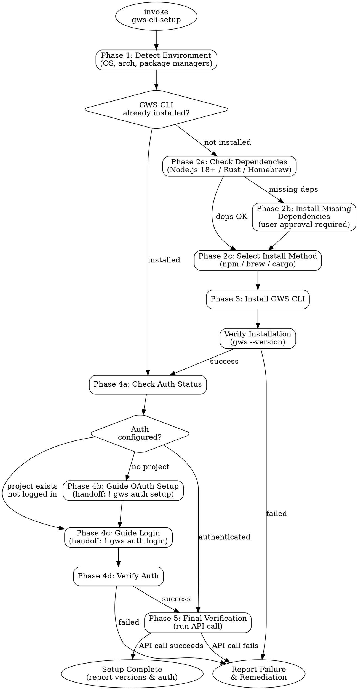

# GWS CLI Setup

<HARD-GATE>
Do NOT declare setup complete until ALL 4 phases pass verification.
Phases: detect environment → install dependencies & CLI → configure auth → verify working state
Skipping verification or declaring success without evidence violates this gate.
</HARD-GATE>

## Checklist

Complete every step in order. Do not skip, reorder, or abbreviate.

1. **Detect environment** — Identify OS, architecture, and available package managers. Record results before proceeding.
2. **Check if GWS CLI is already installed** — Run `gws --version`. If installed, skip to step 6.
3. **Check and install dependencies** — Verify Node.js 18+ (for npm method), Rust/Cargo (for cargo method), or Homebrew (for brew method). Install missing dependencies with user approval. *(pause for user approval before installing)*
4. **Install GWS CLI** — Select the best install method for the detected environment and install. Priority: npm (cross-platform) → brew (macOS/Linux) → cargo (fallback).
5. **Verify installation** — Run `gws --version` and confirm it returns a valid version string. If it fails, report the error and stop.
6. **Check auth status** — Run `gws auth status` to determine if authentication is configured.
7. **Guide auth setup** — If not authenticated, hand off to the user for interactive OAuth. *(pause: instruct user to run `! gws auth setup` then `! gws auth login`)*
8. **Final verification** — Run a real API call (e.g., `gws gmail users.getProfile --userId me`) to confirm end-to-end functionality. Report installed version and auth status.

## Phase Details

### Phase 1: Environment Detection

```bash
# Detect OS and architecture
uname -s    # Darwin, Linux, MINGW64_NT-*
uname -m    # x86_64, arm64, aarch64

# Detect available package managers
command -v npm    && npm --version
command -v brew   && brew --version
command -v cargo  && cargo --version
command -v nix    && nix --version
```

Record: `OS`, `ARCH`, `AVAILABLE_MANAGERS[]`

### Phase 2: Dependency Check & Installation

| Install Method | Required Dependency | Check Command | Install Command |
|---------------|-------------------|---------------|-----------------|
| npm | Node.js 18+ | `node --version` | Platform-dependent (see below) |
| brew | Homebrew | `brew --version` | `/bin/bash -c "$(curl -fsSL https://raw.githubusercontent.com/Homebrew/install/HEAD/install.sh)"` |
| cargo | Rust toolchain | `cargo --version` | `curl --proto '=https' --tlsv1.2 -sSf https://sh.rustup.rs \| sh` |

**Node.js installation by platform:**
- macOS (brew available): `brew install node`
- macOS (no brew): Download from nodejs.org or use nvm
- Linux (apt): `sudo apt-get install -y nodejs npm`
- Linux (yum/dnf): `sudo dnf install -y nodejs npm`

**Install method selection logic:**
```
if npm available AND node >= 18:
    method = "npm"
elif brew available:
    method = "brew"
elif cargo available:
    method = "cargo"
else:
    install npm prerequisites first, then method = "npm"
```

### Phase 3: GWS CLI Installation

| Method | Command |
|--------|---------|
| npm | `npm install -g @googleworkspace/cli` |
| brew | `brew install googleworkspace-cli` |
| cargo | `cargo install --git https://github.com/googleworkspace/cli --locked` |

After installation, verify: `gws --version`

### Phase 4: Authentication Setup

**Check current auth state:**
```bash
gws auth status
```

**If no auth configured — hand off to user:**

Tell the user to run these commands interactively:
1. `! gws auth setup` — Creates a Google Cloud project, enables APIs, and initiates OAuth
2. `! gws auth login` — Completes the OAuth flow and selects scopes

**Important:** These commands require browser interaction. The agent CANNOT run them automatically. Always use the `!` prefix handoff pattern so the user runs them in the current session.

**After user completes auth, verify:**
```bash
gws auth status
```

Confirm the output shows an authenticated state with at least one OAuth scope.

### Phase 5: Final Verification

Run a lightweight API call to confirm end-to-end setup:
```bash
gws gmail users.getProfile --userId me
```

**Success criteria:**
- Command returns a JSON response with the user's email address
- No authentication errors
- No permission errors

**On success, report:**
- GWS CLI version
- Authentication method and scopes
- Authenticated user email

**On failure, report:**
- Exact error message
- Suggested remediation steps

## Process Flow



## Anti-Pattern: "This Is Too Simple"

Every invocation — no matter how straightforward — goes through this full checklist. There are no exceptions.

**Why:** Agents skip dependency checks when the task seems simple. An agent that runs `npm install -g` without verifying Node.js exists will fail silently or produce a confusing error. The gate exists because output pressure, not complexity, causes setup failures.

## Rationalization Table

| Excuse | Counter |
|--------|---------|
| "Node.js is probably already installed, I'll skip the check" | Environment detection takes seconds; debugging a failed install takes minutes. "Probably" is not verification. |
| "CLI is installed, so setup is complete" | Installation is half of setup. Without auth and verification, no GWS command can execute. Declaring an unusable tool as "set up" misleads the user. |
| "OAuth is interactive so I can't automate it — I'll skip it" | Steps that cannot be automated must be handed off to the user, not skipped. The skill must guide the user through `! gws auth setup` and `! gws auth login` and verify the result. Skipping and delegating are not the same. |
| "Homebrew is the simplest method, no need to detect the environment" | Homebrew is unavailable on Linux servers, Windows WSL, and many CI environments. Install method must match the detected environment. |
| "The user said they'll do auth later, so I can skip the handoff" | The user deferring auth does not remove the agent's responsibility to provide clear handoff instructions. Present the exact commands (`! gws auth setup`, `! gws auth login`), explain what each does, and note that setup is incomplete without auth. Inform, don't skip. |

## Portability Adapter

When operating outside Claude Code (e.g. Codex CLI, Gemini CLI):

- **Bash tool:** Use `shell` execution directly. All commands in this skill are standard shell commands.
- **Read tool:** Use `cat` to read configuration files (e.g., `~/.config/gws/credentials.json`).
- **Write tool:** Use shell redirects (`>`, `>>`) to create configuration files.
- **AskUserQuestion tool:** Not available. Print the question and options to stdout, then wait for user input.
- **WebFetch tool:** Use `curl` to check latest release versions if needed.
- **User handoff (`!` prefix):** Not available. Instruct the user to run auth commands directly in their terminal. The interactive OAuth flow always requires user interaction regardless of platform.
