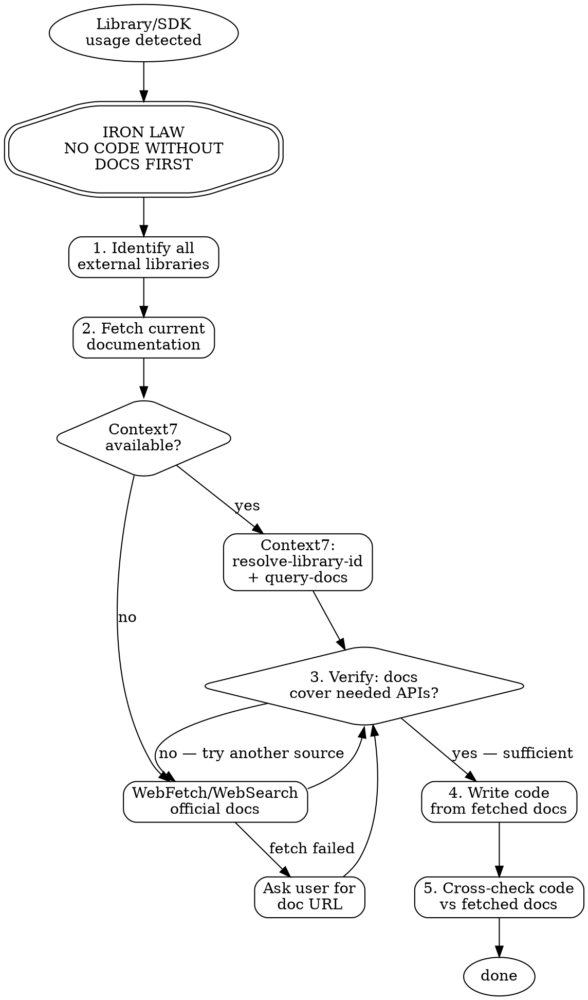

# Knowledge Bridge

## The Iron Law

NO CODE USING EXTERNAL LIBRARIES WITHOUT FETCHING CURRENT DOCUMENTATION FIRST.

No exceptions. If current documentation cannot be fetched, stop and ask the user for it.

This rule is not satisfied by:
- Using training data as a substitute for live documentation
- Fetching docs but not applying them to the code
- Skipping because the library is "well-known"
- Treating the change as "too small" to warrant a docs check
- Claiming familiarity with the API from prior conversations

If current documentation does not exist or cannot be retrieved, stop and ask the user for a documentation URL or version reference.

## Checklist

Complete every step in order. Do not skip or abbreviate.

1. **Detect library usage** — Identify all external libraries, frameworks, SDKs, or APIs that will be used in the code you are about to write or modify.
2. **Fetch documentation** — For each identified library, fetch current documentation using the tool fallback chain (see below).
3. **Verify coverage** — Confirm the fetched docs cover the specific APIs, methods, or patterns you need. If not, fetch from an additional source.
4. **Write code from docs** — Write code using the patterns and APIs found in the fetched documentation, not from training memory.
5. **Cross-check** — Before finalizing, verify that the code you wrote matches the fetched documentation's API signatures, parameter names, and usage patterns.

### Tool Fallback Chain

Use the first available tool. If it fails, move to the next:

1. **Context7 MCP** — `resolve-library-id` to find the library, then `query-docs` with a specific topic
2. **WebFetch** — Fetch the library's official documentation URL directly
3. **WebSearch** — Search for `"{library name}" official documentation {specific API}`
4. **Ask user** — Request the documentation URL or paste the relevant docs

## Red Flags — STOP

If you are thinking any of these thoughts, stop immediately:

| Thought | Reality |
|---------|---------|
| "I know this library well enough from training" | Training data is months old. Google's research showed 28% success without docs vs 97% with. Your confidence is the danger signal. |
| "This is just a small change, no need to check docs" | Small changes are where deprecated APIs slip through. The cost of checking is seconds; wrong code costs a debugging session. |
| "The user is waiting, I'll skip docs this time" | Wrong code is not a fast result. 30 seconds fetching docs vs 30 minutes debugging outdated API calls. |
| "Context7 isn't available, so I can't check" | WebFetch, WebSearch, and asking the user all exist. Tool absence changes the method, not the obligation. |
| "I just used this library in the last message" | Previous conversation context is not the same as current documentation. APIs may have been fetched for a different use case. Re-fetch for the current task. |
| "The docs probably haven't changed for this part" | You cannot know this without checking. Pre-judging doc freshness is the exact rationalization this rule prevents. |

## Process Flow

## Rationalization Table

| Excuse | Counter |
|--------|---------|
| "I know this library well from training data" | Training data is months old. Google's experiment showed 28% success without docs vs 97% with docs. Confidence in training data is the #1 cause of outdated API usage. |
| "This is a minor change, no need for docs" | Minor changes are where deprecated APIs slip through unnoticed. The cost of checking is seconds; the cost of wrong code is a debugging session. |
| "The user wants fast results, no time for docs" | Wrong code is not a fast result. 30 seconds fetching docs vs 30 minutes debugging an outdated API call. |
| "Context7 is not available so I can't check" | WebFetch and WebSearch exist. If all tools fail, ask the user for docs. Tool absence is never a reason to skip — it changes the method, not the obligation. |
| "The official docs won't have what I need" | Fetch first, judge after. Pre-judging doc usefulness is a rationalization to skip the fetch step. |

## Portability Adapter

When operating outside Claude Code (e.g. Codex CLI, Gemini CLI):

- **Context7 MCP:** Not available on Codex CLI or Gemini CLI. Use `curl` to fetch official documentation URLs directly, or use platform-native web search tools.
- **WebFetch:** Not available as a native tool. Use `curl <url>` and process the output manually.
- **WebSearch:** Not available on Codex CLI. Gemini CLI has Google Search. On Codex CLI, ask the user for documentation URLs.
- **Skill invocation:** Not available on Codex CLI. On Gemini CLI, use `activate_skill("knowledge-bridge")`. On Codex CLI, follow this checklist manually.
- **The Iron Law still applies on all platforms.** Tool limitations change the method of fetching docs, never the requirement to fetch them.
