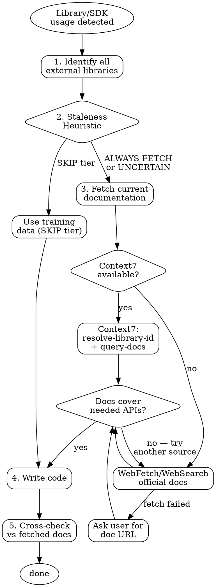

# Knowledge Bridge

## The Iron Law

NO CODE USING EXTERNAL LIBRARIES WITHOUT ASSESSING DOCUMENTATION FRESHNESS FIRST.

No exceptions. If assessment determines docs are needed and they cannot be fetched, stop and ask the user.

This rule is not satisfied by:
- Using training data as a substitute when freshness assessment says "fetch"
- Skipping the assessment because the library "feels" familiar
- Claiming the assessment step itself is unnecessary overhead

## Staleness Heuristic

Before fetching docs, classify each library into one of three tiers. This is the decision that determines whether to fetch.

| Tier | Condition | Action | Examples |
|------|-----------|--------|----------|
| **ALWAYS FETCH** | Cloud service SDK/API client | Fetch docs, no exceptions | `anthropic`, `openai`, `claude_agent_sdk`, `google-cloud-*`, `aws-sdk`, `stripe`, `firebase` |
| **ALWAYS FETCH** | Unrecognized import | Fetch docs, no exceptions | Any library you have not seen in training data |
| **ALWAYS FETCH** | Major version newer than expected | Fetch docs | `package.json` shows Next.js 16 but you only know 15 |
| **FETCH IF UNCERTAIN** | Framework with frequent minor updates | Fetch if using non-trivial APIs | `next`, `nuxt`, `svelte`, `fastapi`, `django` |
| **SKIP** | Stable core API, trivial usage | Proceed from training data | `react` (basic hooks), `express` (basic routing), `lodash`, `path`, `fs` |

### How to classify

```
1. Is this a cloud service SDK or API client?           → ALWAYS FETCH
2. Have I never seen this import in training?            → ALWAYS FETCH
3. Does package.json/requirements.txt show a version
   newer than I expect?                                  → ALWAYS FETCH
4. Am I using advanced/non-trivial APIs of a
   frequently-updated framework?                         → FETCH IF UNCERTAIN
5. Is this a stable library with basic usage?            → SKIP
```

**When in doubt, fetch.** The asymmetry is clear: unnecessary fetch costs 5 seconds, missing a needed fetch costs 30 minutes of debugging.

## Checklist

Complete every step in order. Do not skip or abbreviate.

1. **Detect library usage** — Identify all external libraries, frameworks, SDKs, or APIs in the code you are about to write or modify.
2. **Assess staleness** — Classify each library using the Staleness Heuristic above. Check `package.json` or `requirements.txt` for version hints if available.
3. **Fetch documentation** — For each library classified as ALWAYS FETCH or FETCH IF UNCERTAIN, fetch current documentation using the tool fallback chain.
4. **Write code** — For fetched libraries, use patterns from the documentation. For SKIP-tier libraries, training data is acceptable.
5. **Cross-check** — Verify fetched-doc-based code matches the documentation's API signatures and patterns.

### Tool Fallback Chain

Use the first available tool. If it fails, move to the next:

1. **Context7 MCP** — `resolve-library-id` to find the library, then `query-docs` with a specific topic
2. **WebFetch** — Fetch the library's official documentation URL directly
3. **WebSearch** — Search for `"{library name}" official documentation {specific API}`
4. **Ask user** — Request the documentation URL or paste the relevant docs

## Red Flags — STOP

If you are thinking any of these thoughts, stop immediately:

| Thought | Reality |
|---------|---------|
| "I know this SDK well enough from training" | SDK/API clients are ALWAYS FETCH tier. Your confidence is irrelevant for this category. |
| "I've never heard of this library but I can probably figure it out" | Unrecognized import = ALWAYS FETCH. Do not guess APIs for libraries you haven't seen. |
| "This is just a small change to a stable library" | If the heuristic says SKIP, fine. If it says FETCH, the size of the change doesn't matter. |
| "The user is waiting, I'll skip the assessment" | The assessment takes 2 seconds. Skipping it to save 2 seconds risks 30 minutes of debugging. |
| "Context7 isn't available, so I can't check" | WebFetch, WebSearch, and asking the user all exist. Tool absence changes the method, not the obligation. |
| "The version in package.json is probably what I expect" | Read the file. Don't guess versions. |

## Process Flow



## Rationalization Table

| Excuse | Counter |
|--------|---------|
| "I know this library well from training data" | If the heuristic classifies it as ALWAYS FETCH, your familiarity is irrelevant. Cloud SDKs change monthly. Google's experiment: 28% without docs vs 97% with. |
| "This is a minor change, no need for docs" | The heuristic decides, not the change size. If it's SKIP tier, fine. If not, fetch. |
| "The user wants fast results, no time for assessment" | The assessment is 5 lines of reasoning. It adds 2 seconds. Skipping it is not a time save. |
| "Context7 is not available so I can't check" | WebFetch and WebSearch exist. If all tools fail, ask the user for docs. Tool absence changes the method, not the obligation. |
| "This library is stable, no need to check version" | Read package.json. If the version is newer than you expect, fetch. Don't guess stability. |

## Portability Adapter

When operating outside Claude Code (e.g. Codex CLI, Gemini CLI):

- **Context7 MCP:** Not available on Codex CLI or Gemini CLI. Use `curl` to fetch official documentation URLs directly, or use platform-native web search tools.
- **WebFetch:** Not available as a native tool. Use `curl <url>` and process the output manually.
- **WebSearch:** Not available on Codex CLI. Gemini CLI has Google Search. On Codex CLI, ask the user for documentation URLs.
- **Skill invocation:** Not available on Codex CLI. On Gemini CLI, use `activate_skill("knowledge-bridge")`. On Codex CLI, follow this checklist manually.
- **The Iron Law still applies on all platforms.** Tool limitations change the method of fetching docs, never the requirement to assess and fetch when needed.
