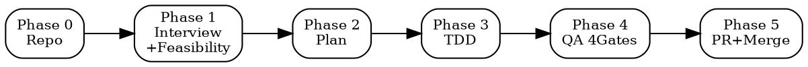

# New Photoshop Tool

비개발자의 자연어 요청으로 Photoshop MCP 도구를 생성한다.



<HARD-GATE>
이 커맨드는 5개 Phase로 구성된다. 각 Phase는 명시된 PASS 조건을 충족해야만 다음 Phase로 진행할 수 있다.
Phase를 건너뛰거나, PASS 조건 없이 진행하거나, "should work"으로 넘어가는 것은 금지.
</HARD-GATE>

## Phase 0: Repo 확인

```bash
REPO=$(find ~ -maxdepth 3 -name "photoshop-mcp" -type d -exec test -f {}/mcp/server.py \; -print -quit 2>/dev/null)
echo "REPO=$REPO"
```

- 경로 출력 → PASS. 이후 모든 명령에서 이 경로 사용.
- 빈 출력 → `git clone https://github.com/bagelcode-gamestudio/photoshop-mcp.git` 후 재실행.

<HARD-GATE>
REPO 경로가 확인될 때까지 Phase 1로 진행 금지.
</HARD-GATE>

---

## Phase 1: Interview + Feasibility

### Step 1: 자연어 인터뷰

**규칙:**
- 기술 용어 금지 (opacity, blend mode, descriptor, batchPlay 등)
- 선택지 제공 ("강하게 / 보통 / 은은하게")
- 최대 3개 질문
- 인자가 있으면 그걸로 시작

질문 순서:
1. "어떤 효과를 원하세요?" (인자 없을 때만)
2. "어떤 느낌으로요?" (선택지 제공)
3. 확인: "이런 느낌으로 만들게요: [설명]. 괜찮으세요?"

사용자 승인 → Step 2.

### Step 2: Registry 체크

```bash
cd $REPO && python3 -c "
import json
registry = json.load(open('registry/tools.json'))
for t in registry['tools']:
    if t['enabled']:
        print(f\"{t['name']}: {t['description']}\")
"
```

- 일치하는 도구 있음 → 바로 사용. 커맨드 종료.
- 유사 도구 있음 → 사용자에게 제안.
- 없음 → Step 3.

### Step 3: 실현 가능성 검증

context7으로 Photoshop batchPlay API 문서를 조회하여:
1. 해당 효과의 `_obj` descriptor 이름 확인
2. 필수 파라미터 목록 확인
3. 기존 핸들러 패턴 확인:

```bash
cd $REPO && grep -r "layerEffects\|_obj" plugin/commands/ | head -20
```

**검증 결과를 반드시 명시:**
- ✅ descriptor 이름: `___`, 참조 핸들러: `___` → PASS
- ❌ descriptor 없음 → "이건 Photoshop API로 자동화할 수 없어요." 사용자에게 수동 방법 안내. 종료.

<HARD-GATE>
batchPlay descriptor를 특정하지 못하면 Phase 2로 진행 금지.
"아마 될 것 같다"는 PASS가 아니다. descriptor 이름과 참조 핸들러를 명시해야 PASS.
</HARD-GATE>

### Step 4: 도구 명세 확정

Phase 1의 결과물 — 이것이 이후 모든 Phase의 입력:

```
function_name: <snake_case>
action_name: <camelCase>
category: <existing or new category>
description_kr: <한국어, 비기술 용어>
description_en: <English docstring>
parameters: <name, type, default, description>
batchplay_descriptor: <_obj name from API docs>
reference_handler: <existing handler to base pattern on>
```

**PASS 조건:** 위 8개 항목이 모두 채워짐.

---

## Phase 2: Plan + Branch

### Step 1: Feature branch 생성

```bash
cd $REPO && git checkout main && git pull origin main
git checkout -b feat/add-<function_name>
```

### Step 2: 구현 계획 작성

Phase 1에서 확정된 도구 명세를 기반으로 다음 구조의 plan을 작성한다:

**파일 구조:**
- `mcp/tools/<category>.py` — Python MCP 함수 추가
- `plugin/commands/<category>.js` — JS UXP 핸들러 추가
- `plugin/commands/index.js` — import 추가 (새 카테고리인 경우)
- `registry/tools.json` — 엔트리 추가
- `tests/unit/test_<category>.py` — 유닛 테스트 추가

**Plan은 bite-sized task로 분해:**
각 step = 하나의 행동 (2-5분 단위). "그리고"가 들어가면 분리.

1. 실패 테스트 작성
2. 테스트 실행 → FAIL 확인
3. 최소 구현 작성
4. 테스트 실행 → PASS 확인
5. JS 핸들러 작성
6. Registry 업데이트
7. Commit

Plan을 사용자에게 제시하고 승인을 받는다.

<HARD-GATE>
Plan이 승인될 때까지 코드 작성 금지.
사용자가 수정을 요청하면 plan 수정 후 재승인.
</HARD-GATE>

---

## Phase 3: Implementation (TDD)

### Step 1: Python 테스트 작성 (RED)

`tests/unit/test_<category>.py`에 테스트 추가.

```bash
cd $REPO && python -m pytest tests/unit/test_<category>.py -v -k "<function_name>"
```

<HARD-GATE>
테스트가 FAIL해야 PASS. 테스트가 통과하면 기존 동작을 테스트하고 있는 것. 테스트 수정.
테스트가 에러(import 등)이면 에러부터 해결.
FAIL 확인 없이 구현 금지.

이것은 "should fail"이 아니다. 실제로 명령을 실행하고 FAIL 출력을 확인해야 한다.
</HARD-GATE>

### Step 2: Python MCP 함수 구현 (GREEN)

`mcp/tools/<category>.py`의 `register_tools(mcp)` 안에 추가.

코드 규칙:
- mutable dict 디폴트 → `None` + guard
- `createCommand` action name = JS handler name (camelCase)
- 모든 파라미터에 디폴트값

```bash
cd $REPO && python -m pytest tests/unit/test_<category>.py -v -k "<function_name>"
```

<HARD-GATE>
테스트가 PASS해야 진행. FAIL이면 구현 수정.
"should pass now"는 증거가 아니다. 실행 출력에서 PASS를 확인해야 한다.
</HARD-GATE>

### Step 3: JS UXP 핸들러 구현

`plugin/commands/<category>.js`에 추가. 규칙:
- `findLayer(layerId)` + null check + `execute()` + `selectLayer()` 패턴 필수
- batchPlay descriptor는 Phase 1에서 확인한 것 사용
- `commandHandlers` 객체에 export
- 새 파일이면 `plugin/commands/index.js`에 import 추가

### Step 4: Registry 업데이트

`registry/tools.json`에 엔트리 추가:
- `description`: 한국어, 기술 용어 금지
- `enabled`: true
- 모든 parameter에 `description` 필드

### Step 5: Commit

```bash
cd $REPO && git add -A && git commit -m "feat: add <function_name> tool"
```

---

## Phase 4: QA (4 Gates)

모든 Gate에서 실제 명령을 실행하고 출력을 확인한다. "should pass"는 증거가 아니다.

### Gate 1: Code Quality

```bash
cd $REPO && python -m ruff check mcp/ && echo "GATE1-LINT: PASS" || echo "GATE1-LINT: FAIL"
cd $REPO && python -m pytest tests/unit/ -v && echo "GATE1-TEST: PASS" || echo "GATE1-TEST: FAIL"
```

FAIL → 수정 → 재실행. 둘 다 PASS일 때만 Gate 2 진행.

### Gate 2: Regression

```bash
cd $REPO && python -m pytest tests/regression/ -v && echo "GATE2-REGRESSION: PASS" || echo "GATE2-REGRESSION: FAIL"
cd $REPO && python scripts/check_registry.py && echo "GATE2-REGISTRY: PASS" || echo "GATE2-REGISTRY: FAIL"
```

FAIL → 기존 도구를 깨뜨린 것. 수정 필수. 둘 다 PASS일 때만 Gate 3 진행.

### Gate 3: Non-Developer Safety

```bash
cd $REPO && python3 -c "
import json, sys
reg = json.load(open('registry/tools.json'))
tool = [t for t in reg['tools'] if t['name'] == '<function_name>'][0]
errors = []
if any(w in tool['description'] for w in ['opacity','blend','descriptor','batch','layer_id','int','str','dict']):
    errors.append('description에 기술 용어 포함')
for k,v in tool['parameters'].items():
    if not v.get('required') and 'default' not in v:
        errors.append(f'{k}: 디폴트값 없음')
    if 'description' not in v:
        errors.append(f'{k}: description 없음')
if errors:
    print('GATE3-SAFETY: FAIL'); [print(f'  {e}') for e in errors]; sys.exit(1)
else:
    print('GATE3-SAFETY: PASS')
"
```

FAIL → registry 수정 → 재실행.

### Gate 4: E2E (Photoshop 필요)

Pre-flight:
```bash
lsof -i :3001 > /dev/null 2>&1 && echo "PROXY: OK" || echo "PROXY: NOT RUNNING"
pgrep -x "Adobe Photoshop" > /dev/null 2>&1 && echo "PS: OK" || echo "PS: NOT RUNNING"
```

미충족 항목이 있으면 사용자에게 정확히 안내하고 **기다린다.**

준비되면 새 도구를 디폴트 파라미터로 호출 → 사용자에게 확인:
> "효과가 적용된 것 같나요?"

- 확인 → GATE4: PASS
- 아니요 → batchPlay descriptor 재검토, Phase 1 Step 3부터 다시

<HARD-GATE>
4개 Gate 모두 PASS가 아니면 Phase 5로 진행 금지.
Gate 실패 시 수정 후 해당 Gate부터 재실행. 접근을 바꿔서라도 PASS시킨다.
포기하지 않는다.
</HARD-GATE>

---

## Phase 5: PR + Merge

### Step 1: Code Review

code-reviewer agent를 디스패치하여 리뷰:

```
Agent(subagent_type="superpowers:code-reviewer") 또는
Agent(subagent_type="feature-dev:code-reviewer")

Context:
- 구현 내용: Phase 1 도구 명세
- BASE_SHA: feat branch 시작점
- HEAD_SHA: 현재 HEAD
- 검토 기준: Phase 1 명세와의 일치, 코드 품질, 보안
```

Agent tool 미사용 환경: 메인 context에서 `git diff main...HEAD`를 읽고 직접 리뷰.

**피드백 처리:**
- Critical → 즉시 수정, commit, Gate 1부터 재검증
- Important → 수정 후 진행
- Minor → 기록, 필요시 후속 PR

<HARD-GATE>
Critical/Important 이슈가 미해결이면 PR 생성 금지.
</HARD-GATE>

### Step 2: Push + PR

```bash
cd $REPO && git push origin feat/add-<function_name>
```

```bash
cd $REPO && gh pr create \
  --title "feat: add <function_name> tool" \
  --body "$(cat <<'EOF'
## New Tool: <function_name>

**설명:** <한국어 설명>
**카테고리:** <category>

## QA Results
- [x] Gate 1: Code Quality (lint + unit tests PASS)
- [x] Gate 2: Regression (기존 도구 영향 없음)
- [x] Gate 3: Non-Developer Safety (디폴트, 한국어, 에러 메시지)
- [x] Gate 4: E2E (Photoshop에서 테스트 완료)

🤖 Generated with [Claude Code](https://claude.com/claude-code)
EOF
)"
```

### Step 3: Merge + 알림

```bash
cd $REPO && gh pr merge --squash
```

실패 시 → CI 로그 확인 → 수정 → re-push → 재시도.

완료 후 사용자에게:
> "도구 준비됐어요! [한국어 설명]. 바로 써볼까요?"

---

## Failure Handling

| 상황 | 대응 |
|------|------|
| Gate 1-3 실패 | 원인 분석 → 수정 → 해당 Gate부터 재실행 |
| Gate 4 실패 | batchPlay descriptor 재검토 → Phase 1 Step 3부터 |
| 같은 Gate 3회 연속 실패 | 접근 방식 변경. 다른 descriptor, 다른 패턴, 다른 구현 시도. 포기하지 않는다. |
| Merge 실패 | CI 출력 확인 → 수정 → 재시도 |
| API에서 지원 안 함 | 사용자에게 솔직히 설명. 수동 방법 안내. |

## Red Flags — STOP

이 생각이 들면 즉시 멈추고 돌아가기:

| Thought | Reality |
|---------|---------|
| "실현 가능성 검증 없이 코드 작성 시작하자" | descriptor 없는 코드는 런타임에 실패. Phase 1 완료 필수. |
| "테스트 FAIL 안 봐도 될 거야" | FAIL을 안 봤으면 테스트가 맞는지 모름. RED 확인 필수. |
| "Gate 하나쯤 건너뛰자" | Gate는 독립적 검증. 건너뛴 Gate가 사용자 장애의 원인이 됨. |
| "should work" / "아마 될 거예요" | 실행 출력만 증거. 추측은 증거가 아님. |
| "Plan 없이 바로 코딩하자" | 4개 파일 수정에 plan 없으면 action_name 불일치 등 발생. |
| "batchPlay 문서 안 봐도 대충 알아" | "대충"은 descriptor 이름이 아님. |
| "main에 직접 commit하자" | feature branch 필수. main 직접 push 금지. |

## Rationalization Table

| Excuse | Counter |
|--------|---------|
| "batchPlay 문서 안 봐도 대충 알아" | "대충"은 descriptor 이름이 아님. descriptor 특정 없이 작성한 JS 핸들러는 런타임에 실패. API 문서 확인은 30초, 디버깅은 30분. |
| "테스트 FAIL 안 봐도 구현이 맞을 거야" | FAIL을 안 봤으면 테스트가 올바른지 모름. 통과하는 테스트는 기존 동작을 검증 중일 수 있음. |
| "Gate 3개 통과했으니 4번째는 넘어가자" | 4 Gate는 독립적 검증. Gate 3 통과가 Gate 4를 보장하지 않음. E2E 없이 merge하면 사용자가 첫 피해자. |
| "도구가 단순해서 plan 불필요" | 단순 도구도 Python + JS + registry + tests 4개 파일 수정. plan 없이 진행하면 파일 간 불일치 발생. |
| "Photoshop 안 켜져 있어서 E2E 건너뜀" | E2E 건너뛰기가 아닌 사용자에게 안내 후 대기. Gate 4는 skip이 아닌 block. |

## Portability Adapter

이 스킬은 외부 플러그인에 의존하지 않는다. 모든 discipline이 inline으로 내장되어 있다.

When operating outside Claude Code (e.g. Codex CLI, Gemini CLI):

- **Agent tool (code review):** Not available. 메인 context에서 `git diff main...HEAD`를 읽고 직접 리뷰 수행.
- **context7 MCP (API docs):** Not available. WebFetch 또는 브라우저로 Adobe Photoshop UXP API 문서 조회.
- **Task tracking:** Not available. 각 Phase 시작 시 `[Phase N/5] Description` 출력.
- **File operations:** Use `cat`, `echo`, shell redirects instead of Read/Write/Edit tools.
- **HARD-GATE는 모든 환경에서 적용.** 플랫폼이 달라도 Phase 순서와 PASS 조건은 변하지 않는다.
