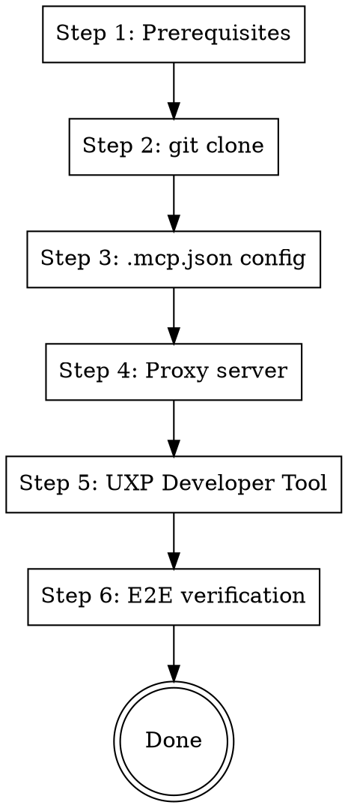

# Photoshop MCP Setup

Photoshop controlled via MCP. All communication stays on localhost — no external servers.

## Architecture

```
Claude ←stdio→ MCP Server (Python/FastMCP) ←ws://localhost:3001→ Proxy (Node.js) ←→ UXP Plugin (JS) ←→ Photoshop
```

## Key Differences from adb-mcp

| | adb-mcp | photoshop-mcp |
|---|---|---|
| Scope | 5 Adobe apps | Photoshop only |
| Tools | 62 in single file | 62 in 9 modular files |
| Extension | Manual | Self-extending (Claude Skills) |
| Registry | None | registry/tools.json |
| Tests | None | unit + e2e + regression |

## Quick Reference

| Component | Path | Min Version |
|-----------|------|-------------|
| MCP Server | `mcp/server.py` | Python 3.10+ |
| Proxy | `proxy/proxy.js` | Node.js |
| UXP Plugin | `plugin/manifest.json` | Photoshop 26.0+ |

Dependencies: `fonttools python-socketio mcp requests websocket-client numpy`

## Setup Flow



---

## Step 1: Prerequisites

Run these 4 checks in **parallel**:

```bash
python3 --version   # 3.10+ required
node --version      # any recent
uv --version        # any
git --version       # any
```

**GATE**: All 4 output versions → PASS. Missing → install first:

| Missing | macOS | Windows |
|---------|-------|---------|
| Python | `brew install python` | python.org |
| Node | `brew install node` | nodejs.org |
| uv | `brew install uv` or `pip install uv` | `pip install uv` |
| git | `brew install git` | git-scm.com |

Also required (manual install):
- **Adobe UXP Developer Tool**: Install from Creative Cloud
- **Photoshop 26.0+**

---

## Step 2: Clone

```bash
git clone https://github.com/bagelcode-gamestudio/photoshop-mcp.git
cd photoshop-mcp
```

**GATE**: `ls mcp/server.py` succeeds → PASS.

---

## Step 3: MCP Server Registration

See [references/mcp-configs.md](references/mcp-configs.md) for `.mcp.json` config.

Key rules:
1. Use `uv` **absolute path** for `command` (`which uv`)
2. Use `mcp/server.py` **absolute path** as last arg
3. Save to project `.mcp.json` or global `~/.claude.json`

**GATE**: MCP tools visible in Claude → PASS.

---

## Step 4: Proxy Server

**Must stay running during work.**

```bash
cd proxy && npm install && node proxy.js
```

**GATE**: Terminal shows:
```
photoshop-mcp proxy running on ws://localhost:3001
```

---

## Step 5: UXP Plugin Install

1. Launch Photoshop
2. Settings > Plugins > **Enable Developer Mode** > restart
3. Launch **UXP Developer Tool** from Creative Cloud
4. File > Add Plugin > select `plugin/manifest.json`
5. Click **Load**
6. In Photoshop plugin panel, click **Connect**

**GATE**: Proxy terminal shows:
```
Client ... registered for application: photoshop
```

IMPORTANT: Must re-Load via UXP Developer Tool after every Photoshop restart.

---

## Step 6: End-to-End Verification

All 3 must pass:

| # | Check | How |
|:-:|-------|-----|
| 1 | Proxy running | Terminal: `running on ws://localhost:3001` |
| 2 | Plugin connected | Proxy terminal: `registered for application` |
| 3 | MCP tools work | Test prompt: "Get info about the current Photoshop document" |

**GATE**: Tool call succeeds + doc info returned → PASS. Setup complete.

---

## Daily Session Startup

After initial setup:

```
1. Run Proxy (cd proxy && node proxy.js)
2. Launch Photoshop
3. UXP Developer Tool > Load > Connect in Photoshop
4. Start Claude
```

---

## Self-Extending Tools

This MCP server can create new tools on demand. When a needed tool doesn't exist:

1. Claude interviews you (natural language, no tech terms)
2. Checks if the tool can be built (Photoshop API feasibility)
3. Generates code (Python MCP + JS plugin handler + tests)
4. Runs 4-gate QA (lint, E2E, regression, safety)
5. Auto-merges and notifies #mcp-photoshop

See `skills/tool-request.md`, `skills/tool-generator.md`, `skills/tool-qa.md` in the repo.

---

## Troubleshooting

| Symptom | Cause | Fix |
|---------|-------|-----|
| MCP server error | `uv` relative path | `which uv` → use absolute path |
| Connect no response | Proxy not running | `lsof -i :3001`, restart Proxy |
| Plugin Load fails | Developer Mode off | PS: Settings > Plugins > Enable |
| Slow responses | Context accumulation | Start new conversation |

More issues: https://github.com/bagelcode-gamestudio/photoshop-mcp/issues
